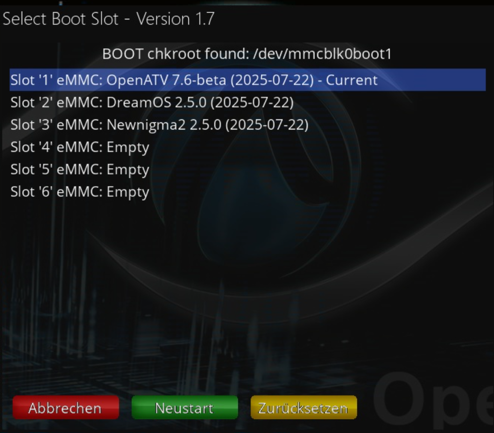
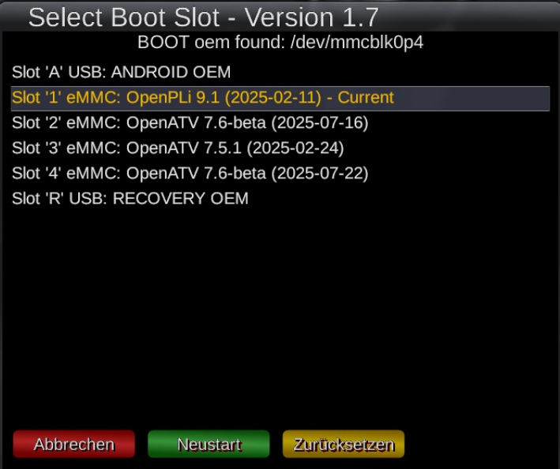
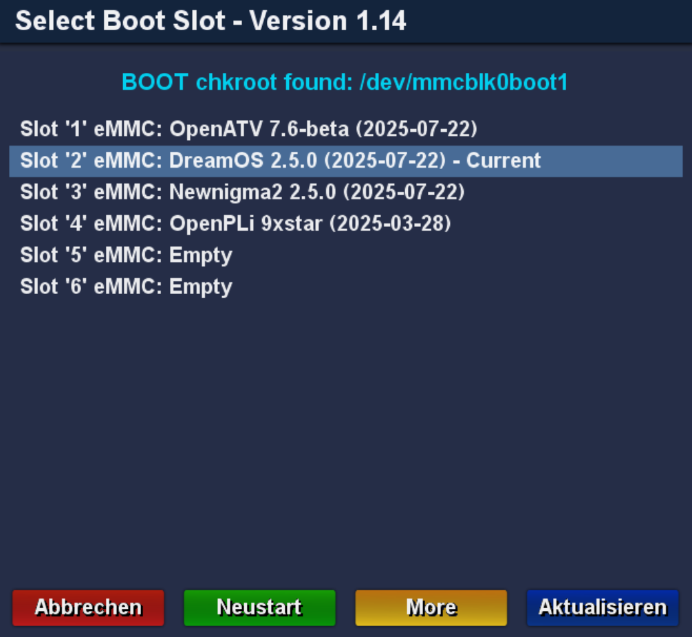
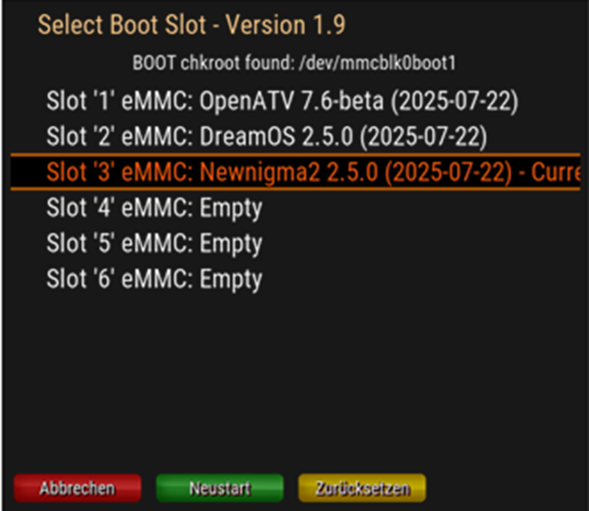

# Legacy MultiBoot Selector Plugin for Enigma2

[](https://www.gnu.org/licenses/gpl-3.0.html#license-text)
[](https://github.com/oe-alliance/MultiBootSelectorPlugin/actions)
[](https://github.com/oe-alliance/MultiBootSelectorPlugin/actions)
[](https://github.com/oe-alliance/MultiBootSelectorPlugin/tags)
[](https://github.com/oe-alliance/MultiBootSelectorPlugin/releases/latest)
[](https://github.com/oe-alliance/MultiBootSelectorPlugin/releases)

## 📦 Overview

**Legacy MultiBoot Selector Plugin for Enigma2** is a lightweight plugin enabling users to view and select available multiboot slots directly from their Enigma2 receiver GUI. It integrates seamlessly with Images without built-in multiboot support.

---

## 🚀 Features

- Uses backend (bash) script for slot switching
- Dynamic list of available multiboot slots
- Displays current active boot slot
- Safe restart into the selected slot
- Accessible via Plugin Menu, Extensions Menu, and Shutdown Menu
- Clean and minimal user interface
- Update the plugin from within the GUI (blue button)

---

## 🖼️ Screenshots

| OpenATV | OpenPLi | DreamOS | NewNigma2 |
|---------|---------|---------|-----------|
|  |  |  |  |

---

## 🛠️ Technical Details

- **Plugin Type:** Enigma2 python plugin
- Python Compatibility: Fully compatible with both Python 2 and Python 3 environments
- **Tested On:** several images without built-in multiboot support
- **Load Condition:** Only loads if `BoxInfo.getItem("HasChkrootMultiboot")` is `None` or unavailable (therefore it is not loaded on current OE Alliance images with integrated multiboot support)

---

### 🔧 How It Works

1. Lists slots by running:
   ```bash
   /usr/bin/multiboot-selector.sh list
2. Displays each slot in a selectable GUI list.
3. On selection, runs:
   ```bash
   /usr/bin/multiboot-selector.sh <slot_number>
4. Initiates a safe reboot to boot from the selected slot.

---

### 📂 Installation

1. Go to the [Releases](https://github.com/oe-alliance/MultiBootSelectorPlugin/releases) page and download the latest .ipk or .deb package for your image.
2. Transfer the package to your Enigma2 receiver via FTP, SCP, or USB.
3. Install it via command line:
   - For .ipk (older OpenATV, OpenPLi, etc.):
      ```bash
      opkg install /tmp/enigma2-plugin-extensions-multibootselector_*.ipk

   - For .deb (DreamOS, NewNigma2, etc.):
      ```bash
      dpkg -i /tmp/enigma2-plugin-extensions-multibootselector_*.deb
4. Restart Enigma2 GUI or reboot your device.

---

### 🔄 Built-in Updater

Once the plugin is installed, you can update to the latest GitHub release directly from within the plugin interface.

To update:
1. Open the plugin
2. Press the blue button
3. Confirm update when prompted

The plugin will automatically fetch the latest release from GitHub and install it.

---

### 🖥️ Usage

1. Launch the plugin from:
   - Plugins Menu
   - Extensions Menu
   - Shutdown Menu
2. Use the arrow keys to navigate and select the boot slot
3. Use color buttons for the following actions:
   - Red – Cancel / Exit
   - Green – Boot selected image
   - Yellow – More info
   - Blue – Check for and install plugin updates

---

### 📜 License
This plugin is released under GPLv3. See [LICENSE](https://www.gnu.org/licenses/gpl-3.0.html#license-text) for full details.

---

### 🤝 Contributing
Pull requests are welcome for:
- Feature enhancements
- Translations
- Integration improvements

Please fork the repository, create a feature branch, and submit a Pull Request.
