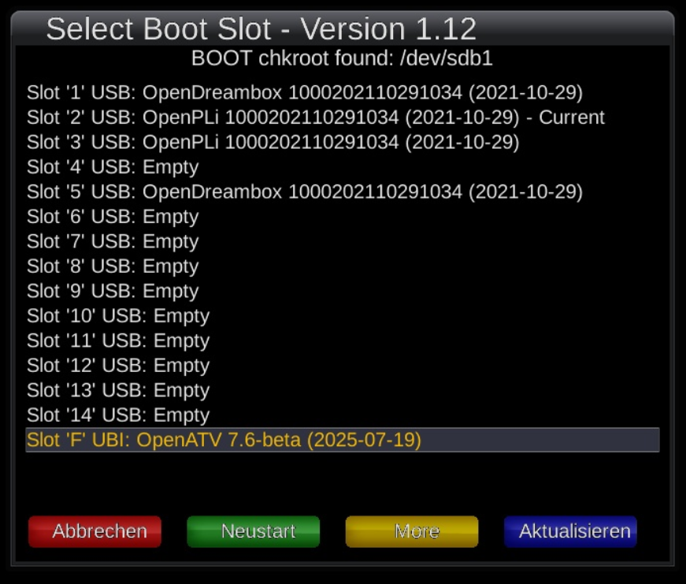
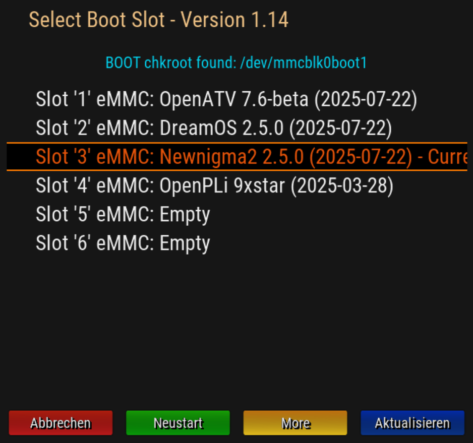

# Enigma2 Legacy MultiBoot Selector

[](https://www.gnu.org/licenses/gpl-3.0.html#license-text)
[](https://github.com/oe-alliance/MultiBootSelectorPlugin/tags)
[](https://github.com/oe-alliance/MultiBootSelectorPlugin/actions)
---

## 📦 Overview

**Legacy MultiBoot for Enigma2** is a lightweight plugin enabling users to view and select available multiboot slots directly from their Enigma2 receiver GUI. It integrates seamlessly with Images without built-in multiboot support.

---

## 🚀 Features

- Calls backend script for slot switching
- Dynamic list of available multiboot slots
- Displays current active boot slot
- Safe restart into the selected slot
- Accessible via Plugin Menu, Extensions Menu, and Shutdown Menu
- Clean and minimal user interface

---

## 🖼️ Screenshots

| OpenATV | OpenPLi | DreamOS | NewNigma2 |
|---------|---------|---------|-----------|
|  |  |  |  |

---

## 🛠️ Technical Details

- **Plugin Type:** Enigma2 python plugin
- **Backend Dependency:** `/usr/bin/multiboot-selector.sh` with executable permissions
- **Tested On:** several images without built-in multiboot support
- **Load Condition:** Only loads if `BoxInfo.getItem("HasChkrootMultiboot")` is `None` or unavailable (therefore it is not loaded on current OE Alliance images with integrated multiboot support)

---

### 🔧 How It Works

1. Lists slots by running:
   ```bash
   /usr/bin/multiboot-selector.sh list
2. Displays each slot in a selectable GUI list.
3. On selection, runs:
   ```bash
   /usr/bin/multiboot-selector.sh <slot_number>
4. Initiates a safe reboot to boot from the selected slot.

---

### 📂 Installation

1. Clone the repository:
   ```bash
   git clone https://github.com/oe-alliance/MultiBootSelectorPlugin.git
2. Copy all files contained in `src` folder to:
   ```bash
   /usr/lib/enigma2/python/Plugins/Extensions/MultiBootSelector/
3. Ensure backend script is available and executable ([current version](https://raw.githubusercontent.com/oe-alliance/oe-alliance-core/refs/heads/5.6-beta/meta-oe/recipes-kernel/chkroot/multiboot-selector/multiboot-selector.sh)):
   ```bash
   chmod +x /usr/bin/multiboot-selector.sh
4. Restart Enigma2 GUI or reboot your device.

---

### ❗ Limitations

- Requires an existing `/usr/bin/multiboot-selector.sh` script for functionality.

---

### 📜 License
This plugin is released under GPLv3. See [LICENSE](https://www.gnu.org/licenses/gpl-3.0.html#license-text) for full details.

---

### 🤝 Contributing
Pull requests are welcome for:
- Feature enhancements
- Translations
- Integration improvements

Please fork the repository, create a feature branch, and submit a Pull Request.
